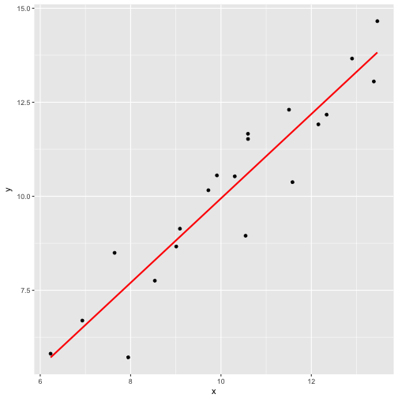

Simple LM Model Builder
========================================================
author: Esko Nuutila
date: 2017-02-13
autosize: true

* A web app that helps people understand how a simple linear regression model is built.

* Understanding how the points in the input data affect the model.

* Interactive manipulation of data points may be more understandable than editing a script or a data file.

How simple linear models are typically demonstrated
========================================================


```r
library(ggplot2)
x <- rnorm(20, mean=10, sd=2)
y <- x + rnorm(20, sd=1)
df <- data.frame(x=x, y=y)
model <- lm(y ~ x, data=df)
ggplot(df, aes(x, y)) + geom_point() + geom_smooth(method="lm", color="red", se=FALSE)
```



Demonstrating how modifying the data changes the model
========================================================

* Editing the input files is not practical in a web app.

* Direct manipulation of the input data is more practical.

* The user adds points to the dataset and immediately sees the effect on the model.


Simple user interface
========================================================

* In addition to editing the points, the scales can be easily changed.


Online documentation
========================================================

* All the required documentation is in the app.


